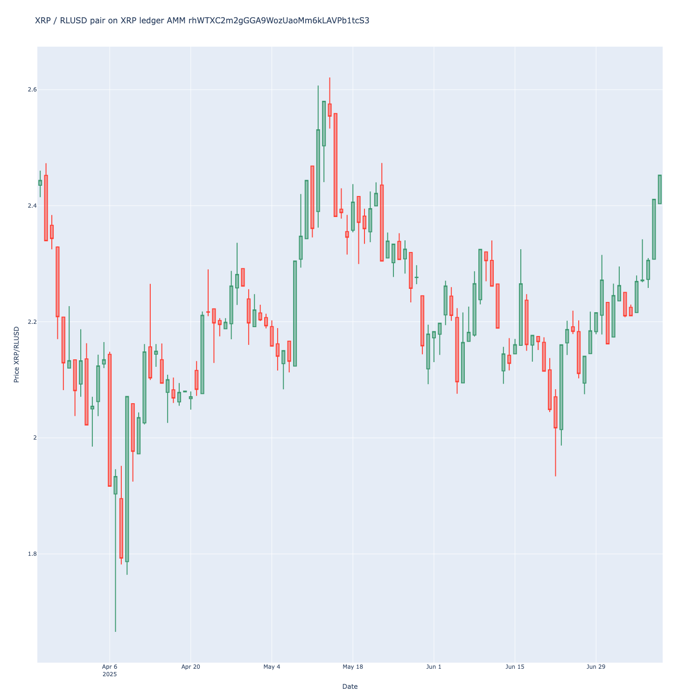

# Web3-XRPL-DeFi

Python integrations for XRP ledger Web3 and DeFi ecosystem.

**This is alpha version of the library**

## Preface

This is a proof of concept for XRP trading data integration. In this PoC, 
we show how to transform raw XRP Ledger transaction data to market data useful for automated trading and data research.

 👉 [See the example notebook on how it works](./examples/crypto-xrp-price.ipynb).

## Use cases

- Market data analysis
- Trade automation
- Trading strategy development and backtesting
- Data research and quant finance

## Features 

- Open source
- Direct data feeds from XRP Leddger JSON-RPC, with robustness for network error tolerances
- AMM data fetching
- Price chart rendering
- Jupyter notebook research utilities
- Helpers to handle XRP DeFi data conversions

An example price chart from [XRPL AMM rhWTXC2m2gGGA9WozUaoMm6kLAVPb1tcS3](https://xrpscan.com/account/rhWTXC2m2gGGA9WozUaoMm6kLAVPb1tcS3).

## System architecture

This Python library forms the core of the XRP ledger automated trading infrastructure, and deploying self-custodial trading strategies on XRP Ledger.

Three primary components are needed for algorithmic 
- **Market data indexer**: Transforms raw XRP Ledger transactions to useable market data that can be consumed by data researches and strategies. This is a custom Python indexer and transformer this project is building.
- **Strategy code**: the strategy itself. A strategy can be developed and deployment by any quant finance expert. A strategy will be deployed as a combination off onchain (Escrow) and offchain (oracles) combination. [To learn more about different strategies and algorithmic trading, please see the library here](https://tradingstrategy.ai/docs/learn/). The strategy reads market data, and takes different trading decisions like entering and exiting token holding positions, based on the price action. External data feeds, like social sentiment data and US treasury rates, can be used as an input as well.
- **Trade executor**: Converts logical trade decisions (open/close/increase/decrease position/provide liquidity) to raw XRP ledger transactions. Broadcasts these transctions in a robust manner, monitors the transaction propagation, does post-trade analysis for executed price. 
- **Escrow and capital management**: Allows self-custodial management of trading capital using XRP ledger Escrow object. In the future, more of this logic can be moved onchain when new XRP Ledger smart contract and hook features become available.

## Installation

- Checkout the repo
- Install with `poetry install`
- Open an example notebook in Visual Studio Code
- Choose right Python environment for running Jupyter Notebook
- Run

## Related projects

- [Web3-Ethereum-Defi](https://github.com/tradingstrategy-ai/web3-ethereum-defi)
- [XRPL-py](https://github.com/XRPLF/xrpl-py)
- [Pandas](https://pandas.pydata.org/)
- [Python}](https://www.python.org/)

## Questions

- [Come to Discord](https://tradingstrategy.ai/community)